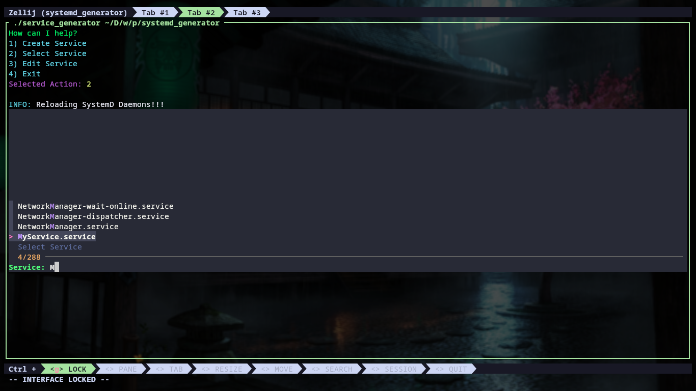

# SystemD Service Generator

A simple bash script to generate/control systemd services.

## Dependencies

This script requires the following dependencies:

- `systemd`
- `fzf`
- `tput`
- `getent`
- `vim`
- `xclip`
- `id`

Make sure these dependencies are installed on your system. If any are missing, the script will display an error.

## Usage

The script works in interactive mode only!!

Some modes and options requires Root Privileges, sudo will be used so you will be prompted for your password.

The script has 3 modes:

- `Create` to generate a new empty and unusable service.
- `Control` to control a service (Start/Stop/Enable/Disable/Logs/...).
- `Edit` to edit a service (add/remove directives to control service behavior).

Ensure the script has execution privileges:

```bash
chmod +x service_generator
```

## TODO

[] Allow user to set service dependencies (Requires, After, etc...) using the edit mode.

[] Allow user to manage environment variables from the edit mode.

[] Allow user to define templates

## Screenshots

- The Main Menu


- Creating a new service


- Searching for a service using FZF



- Control a service


- Edit Service Mode


- Set manual directive `Service,ExecStart` to `my_binary`
- Set the service working directory to the current location using option 5
- Finally set the user to `davenchy` using option 6


- Save Service


## Help Messages

### Control Mode

```bash
# Help messages for Control Mode

Status:
	Show service status

Start:
	Start the service

Stop:
	Stop the service

Restart:
	Restart the service

Enable:
	Enable the service to start at boot time

Disable:
	Disable the service to start at boot time

Print:
	Print the service configuration

Logs:
	Show the service logs

Follow Logs:
	Show the service logs and wait for new updates

Edit:
	Enter edit mode to edit the service

Help:
	Show this help message

Editor:
	Open the service file in a text editor (\$EDITOR)

Remove:
	Stop, Disable then Remove the service

Clipboard:
	Copy the service file content into your system clipboard

Copy:
	Copy the service configuration to a new name

Rename:
	Rename the service to a new name

Create Service:
	Create a new service

Select Service:
	Select another service

Back:
	Go back one step

Exit:
	Exit this script

```

### Edit Mode

```bash
# Help messages for Edit Mode

List:
	List the service file with colored current values

List Section:
	List all directives with its values for a selected section

Copy Value:
	Select key and copy its value to system clipboard

Set:
	Select (Section:Directive) and set its value, set empty value to remove the directive

Set Manual:
	Use manual key(Section:Directive) to create/set/remove directive

Set Current Working Directory:
	Sets (Service:WorkingDirectory) to current working directory

Set User:
	Sets (Service:User) to the selected user

Set Group:
	Sets (Service:Group) to the selected group

Set Type:
	Sets (Service:Type) to the selected service types

Control Mode:
	Enter Control Mode for the current service

Help:
	Print this help message

Reload:
	Reload the current service file and discard changes

Save:
	Save the current changes to the service file, Reload SystemD Daemons and return back to the control mode

Back:
	Discard current changes and return back to control mode

Exit:
	Discard current changes and exit the script

```
