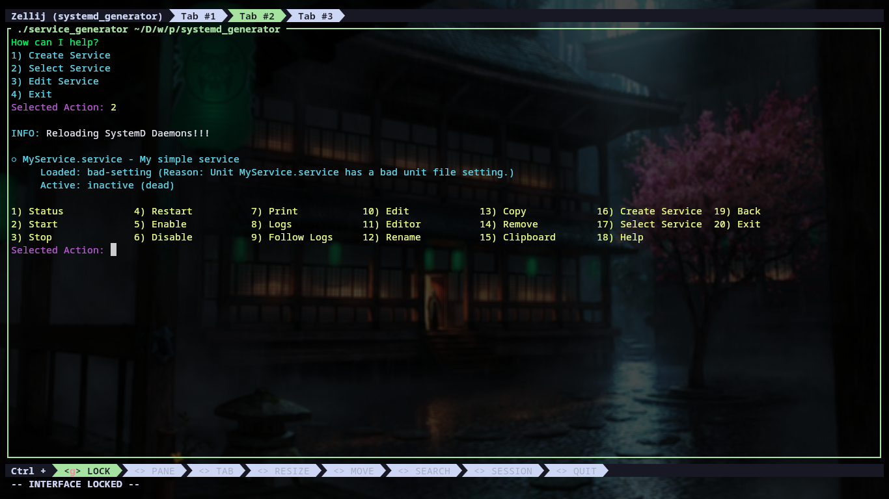

# SystemD Service Generator

A simple bash script to generate/control systemd services.

## Dependencies

This script depends on: `systemd` `fzf` `tput` `getent` `vim` `xclip`

## Usage

The script works in interactive mode only!!

The script has 3 modes:

- `Create` to generate a new empty and unusable service.
- `Control` to control a service (Start/Stop/Enable/Disable/Logs/...).
- `Edit` to edit a service (add/remove directives to control service behavior).

## Screenshots

- The Main Menu

- Creating a new service

- Searching for a service using FZF

- Control a service

